# Music Waterfall

[](https://github.com/j-loquat/music-waterfall/actions/workflows/ci.yml)
[](https://www.python.org/)
[](https://www.microsoft.com/windows/windows-11)
[](LICENSE)

Music Waterfall is a local Windows desktop application that turns a piano MIDI file,
or human-reviewed sheet-music recognition, into a synchronized falling-note practice
video. Every preview and final MP4 shows the complete 88-key piano so the player's
location is always clear.

The application keeps the whole score-processing workflow on the PC. It has no cloud
service, account, upload, or telemetry. PDFs are never treated as automatically correct:
Audiveris performs optical music recognition, MuseScore Studio provides the human repair
step, and rendering stays locked until the selected MusicXML converts successfully and
the user explicitly marks it reviewed.

## What it can do

- Import `.mid` and `.midi` files directly.
- Inspect MIDI tracks, channels, programs, note ranges, tempo changes, and duration.
- Assign each MIDI track to the left hand, right hand, both hands with a split point, or
  ignore it.
- Create both-hands, left-hand-only, and right-hand-only practice videos.
- Render at 50%, 70%, 85%, or 100% tempo.
- Control look-ahead time, note-name labels, count-in, and end tail.
- Render a short 1280 x 720 at 30 fps preview or a full 1920 x 1080 at 60 fps video.
- Show the full A0-to-C8, 88-key keyboard in every video.
- Synthesize piano audio locally with FluidSynth and a user-selected SoundFont.
- Encode H.264 video and AAC audio with FFmpeg.
- Verify stream formats, frame rate, dimensions, and start/end synchronization with
  FFprobe.
- Create a PDF project, run Audiveris locally, preserve the `.omr` and original MusicXML,
  open the score in MuseScore Studio, import corrected MusicXML, and enforce a human
  review gate before rendering.
- Save every job as a resumable project with source checksums, settings, timelines,
  artifacts, logs, previews, and final renders.
- Provide the same core workflow through a PySide6 GUI and a command-line interface.

Music Waterfall imports MIDI files; it does not currently record live input from a MIDI
keyboard. It is also not a notation editor. MuseScore Studio handles notation repair.

## How the application works

```mermaid
flowchart LR
    MIDI["MIDI file"] --> Timeline["Canonical performance timeline"]
    PDF["Sheet-music PDF"] --> Audiveris["Local Audiveris OMR"]
    Audiveris --> Unreviewed["Unreviewed MusicXML"]
    Unreviewed --> MuseScore["Human correction in MuseScore"]
    MuseScore --> Export["Export corrected MusicXML"]
    Export --> Gate["Successful conversion and explicit approval"]
    Gate --> Timeline
    Timeline --> Frames["Shared 88-key waterfall renderer"]
    Timeline --> PerformanceMIDI["Tempo-scaled performance MIDI"]
    PerformanceMIDI --> FluidSynth["FluidSynth plus SoundFont"]
    FluidSynth --> Normalize["Measured, trimmed or padded WAV"]
    Frames --> FFmpeg["FFmpeg H.264/AAC encoder"]
    Normalize --> FFmpeg
    FFmpeg --> MP4["Synchronized MP4"]
    MP4 --> FFprobe["FFprobe boundary verification"]
```



The performance timeline is the timing authority. The selected tempo, count-in, and
explicit tail determine the target frame count and final duration. FluidSynth's raw WAV
is measured, but its natural release tail never controls video length. Music Waterfall
prepends count-in silence and trims or pads the PCM stream to the exact target sample
count, then rejects the MP4 if audio and video starts or ends differ by more than one
video frame.

## Supported platform

The supported and tested platform is:

- Windows 11 x64
- Python 3.12
- PowerShell 5.1 or newer
- A local internet connection during installation
- Enough free disk space for MuseScore Studio, Audiveris, the Python environment, and
  generated video

The application runs offline after installation. Windows 10, ARM64 Windows, Linux, and
macOS may work with changes, but they are not currently supported or tested.

## Install on Windows 11

### Recommended installation

Open a normal PowerShell window. Administrator mode is not normally required, although
Windows may show an elevation prompt for an external application installer.

First install Git if it is not already available:

```powershell
winget install --id Git.Git --exact --source winget --accept-package-agreements --accept-source-agreements
```

If `git` is still not recognized after that command, close PowerShell and open a new
PowerShell window. Then clone the repository and run its installer:

```powershell
New-Item -ItemType Directory -Force -Path "$env:USERPROFILE\source" | Out-Null
Set-Location "$env:USERPROFILE\source"
git clone https://github.com/j-loquat/music-waterfall.git
Set-Location .\music-waterfall
powershell.exe -NoProfile -ExecutionPolicy Bypass -File .\scripts\install-windows.ps1
```

The execution-policy option applies only to that PowerShell process. The script does not
change the machine-wide PowerShell policy.

The installer performs these actions:

1. Checks for WinGet, then installs or updates uv as the first external package.
2. Installs or updates FFmpeg/FFprobe, Audiveris, and MuseScore Studio from WinGet.
3. Downloads the current stable official FluidSynth Windows x64 archive from its GitHub
   release page.
4. Requires and verifies the SHA-256 digest supplied with the FluidSynth release asset.
5. Installs FluidSynth under `%LOCALAPPDATA%\MusicWaterfall\tools\fluidsynth`.
6. Uses uv to find or install Python 3.12.
7. Creates the repository-local `.venv` and synchronizes the exact package versions in
   `uv.lock`.
8. Saves any required local tool-path overrides in
   `%LOCALAPPDATA%\MusicWaterfall\config.json`.
9. Runs the tool doctor, linter, full test suite, local media integration test when its
   tools are available, and package build.

Do not run `MuseScore4.exe --version` while diagnosing an installation. On some Windows
builds that command opens a modal dialog. Music Waterfall reads MuseScore's installed
product metadata instead.

### Launch the GUI

Open the repository directory in File Explorer. Double-click
[`Launch Music Waterfall.bat`](Launch%20Music%20Waterfall.bat). The launcher opens the
correct repository directory, finds uv in the standard Windows locations, and starts the
GUI. Keep the launcher window open while Music Waterfall runs.

For one-click desktop access, right-click `Launch Music Waterfall.bat`, select **Show more
options > Send to > Desktop (create shortcut)**. You can set **Run** to **Minimized** in
the shortcut properties if you do not want the launcher window in front of the GUI.

To verify the launcher without opening the GUI, run:

```powershell
& ".\Launch Music Waterfall.bat" --check
```

The expected result includes the detected uv path and uv version. If the launcher cannot
find uv, it shows the exact installer command to run.

You can also launch the GUI directly from PowerShell:

```powershell
uv run music-waterfall-gui
```

The equivalent command is:

```powershell
uv run music-waterfall gui
```

Keep the PowerShell window open while the GUI runs. Closing it terminates the application.

### Confirm the installation later

```powershell
Set-Location "$env:USERPROFILE\source\music-waterfall"
uv run music-waterfall doctor
uv run pytest -q
```

Every doctor row must say `OK`. A normal known-good setup contains:

- FFmpeg and FFprobe
- FluidSynth
- Audiveris 5.x
- MuseScore Studio 4
- a local `.sf2` or `.sf3` SoundFont

The versions may be newer than the versions used during the original validation. The
known-good development machine used Python 3.12, FluidSynth 2.4.7, Audiveris 5.11.0,
MuseScore Studio 4.7.4, and the `MS Basic.sf3` SoundFont installed by MuseScore.

### Installer options

If all external applications are already installed and you only want to rebuild the
Python environment and verify discovery:

```powershell
powershell.exe -NoProfile -ExecutionPolicy Bypass -File .\scripts\install-windows.ps1 -SkipExternalTools
```

Use `-SkipTests` only for a temporary diagnostic installation. Run the omitted checks
before relying on the application:

```powershell
powershell.exe -NoProfile -ExecutionPolicy Bypass -File .\scripts\install-windows.ps1 -SkipTests
```

### Manual installation fallback

Use these commands if you need to install the WinGet components one at a time:

```powershell
winget install --id astral-sh.uv --exact --source winget --accept-package-agreements --accept-source-agreements
winget install --id Gyan.FFmpeg --exact --source winget --accept-package-agreements --accept-source-agreements
winget install --id audiveris.org.Audiveris --exact --source winget --accept-package-agreements --accept-source-agreements
winget install --id Musescore.Musescore --exact --source winget --accept-package-agreements --accept-source-agreements
```

Download FluidSynth only from the
[official FluidSynth releases](https://github.com/FluidSynth/fluidsynth/releases). Choose
the current Windows x64 ZIP, verify the release digest, extract it to a stable local
directory, and save its path:

```powershell
uv run music-waterfall set-tool fluidsynth "C:\path\to\fluidsynth.exe"
```

Then install the locked Python environment:

```powershell
uv python install 3.12
uv sync --locked --all-groups
uv run music-waterfall doctor
```

If `MS Basic.sf3` is unavailable, choose a locally installed, license-compatible
SoundFont and configure it:

```powershell
uv run music-waterfall set-tool soundfont "C:\path\to\piano-or-gm-soundfont.sf2"
```

The same override pattern works for `ffmpeg`, `ffprobe`, `audiveris`, and `musescore`.

## Installation by an AI agent

An agent can complete the installation on a different Windows 11 PC without relying on
this conversation. Give it the repository URL and this prompt:

```text
Install and validate Music Waterfall from
https://github.com/j-loquat/music-waterfall on this Windows 11 PC. Read AGENTS.md,
README.md, and THIRD_PARTY_NOTICES.md completely before acting. Use the documented
PowerShell installer and uv lockfile. Keep score processing local and offline. Never
invoke MuseScore4.exe --version. Confirm every doctor row, run Ruff, the complete pytest
suite including the local media integration test when tools are present, and uv build.
Launch the GUI once to confirm it starts. Do not upload any score or commit generated
files. Report installed paths and versions, exact check results, and any remaining manual
step.
```

An agent should use these core commands after cloning:

```powershell
powershell.exe -NoProfile -ExecutionPolicy Bypass -File .\scripts\install-windows.ps1
uv run music-waterfall doctor
uv run ruff check src tests
uv run ruff format --check src tests
uv run pytest -q
uv build
& ".\Launch Music Waterfall.bat" --check
uv run music-waterfall-gui
```

## MIDI workflow in the GUI

1. Launch Music Waterfall.
2. Choose a MIDI file and create a project.
3. Review the detected tracks. Assign each useful track to **Left**, **Right**, or
   **Both**, or set it to **Ignore**. Adjust the split pitch for a mixed track if needed.
4. Choose the practice variant, tempo, look-ahead, note labels, count-in, and tail.
5. Render a short preview. Check hand colors, note timing, framing, and sound.
6. Render the full video when the preview is correct.
7. Open the saved project later by selecting its `project.json` file.

The source MIDI is copied into the project and verified with SHA-256. The original file is
never edited.

## PDF and sheet-music workflow in the GUI

1. Choose a clean, printed sheet-music PDF and create a PDF project.
2. Run local Audiveris recognition. Music Waterfall saves Audiveris's `.omr`, original
   MusicXML, validation report, and log under the project.
3. Open the recognized MusicXML in MuseScore Studio and compare every measure against the
   PDF. Correct pitches, durations, voices, ties, accidentals, key and time signatures,
   repeats, endings, dynamics that affect playback, and missing measures.
4. Save the editable working score as `.mscz`.
5. In MuseScore, use **File > Export** to create `.mxl` or `.musicxml`. Saving the `.mscz`
   file alone does not update Music Waterfall.
6. Import the corrected MusicXML into Music Waterfall. The import is copied and hashed;
   the original Audiveris output remains unchanged.
7. Choose **Mark score reviewed**. In the GUI this button is the explicit approval action;
   there is no second checkbox or confirmation dialog. Approval succeeds only if the
   selected MusicXML converts into a valid performance timeline.
8. Review hand assignments and settings, then render a preview and the full video.

Importing any new correction resets the project to **Unreviewed** and locks rendering
again. If conversion fails, the project remains unreviewed and records a diagnostic file
under `logs/`.

### Repairing repeats, Voltas, and endings

MusicXML must describe repeat playback unambiguously. If conversion reports badly formed
repeats or repeat expressions, use the **Repeat & MusicXML tips** button in the PDF
workflow and repair the score in MuseScore:

1. Save the current work as an `.mscz` working copy.
2. Check that each repeated section has a matching start-repeat and end-repeat barline.
3. Select every Volta or ending and inspect its **Repeat list** and **Play count** in
   MuseScore's Properties panel. First and second endings must refer to the intended
   passes and be attached to the correct measures.
4. Remove orphaned endings, stacked repeat barlines, duplicate D.C./D.S. instructions,
   and conflicting coda or Fine playback instructions.
5. If the notation remains ambiguous, make a separate linear playback copy and write the
   measures in performance order without repeat jumps. Keep the original score unchanged.
6. Play the complete score in MuseScore from start to finish to confirm the measure order.
7. Save the working `.mscz`, then use **File > Export** to create fresh MusicXML.
8. Import that exported file into Music Waterfall and choose **Mark score reviewed** again.

Optical music recognition is inherently imperfect. The review gate is a safety and
quality boundary, not a claim that the software can prove a score is musically correct.

## Command-line workflow

Show all commands:

```powershell
uv run music-waterfall --help
```

### MIDI example with the public-domain fixture

```powershell
uv run music-waterfall inspect-midi tests\fixtures\midi\fur-elise-mutopia.mid
uv run music-waterfall create-midi tests\fixtures\midi\fur-elise-mutopia.mid --name fur-elise
uv run music-waterfall preview output\fur-elise\project.json --seconds 12
uv run music-waterfall render output\fur-elise\project.json --preset final
```

If `output\fur-elise` already exists, the new project receives a numeric suffix. Use the
`project.json` path printed by `create-midi`.

Verify a final MP4 independently:

```powershell
uv run music-waterfall verify "output\fur-elise\renders\video-name.mp4" --width 1920 --height 1080 --fps 60
```

### PDF command sequence

```powershell
uv run music-waterfall create-pdf "C:\Scores\score.pdf" --name score
uv run music-waterfall run-omr output\score\project.json
uv run music-waterfall open-score output\score\project.json
uv run music-waterfall mark-reviewed output\score\project.json --i-reviewed
uv run music-waterfall preview output\score\project.json --seconds 12
```

Importing corrected MusicXML is currently a GUI operation. The CLI's `--i-reviewed` flag
is deliberately required because a script must make the approval explicit.

### Other useful commands

```powershell
uv run music-waterfall show output\fur-elise\project.json
uv run music-waterfall assign-track output\fur-elise\project.json 1 right
uv run music-waterfall assign-track output\fur-elise\project.json 2 left
uv run music-waterfall settings output\fur-elise\project.json --variant both --tempo 85 --note-names --count-in --count-in-beats 4 --tail 1
uv run music-waterfall render output\fur-elise\project.json --preset saved
```

## Project storage and privacy

Every runtime project is created beneath the repository's ignored `output/` directory:

```text
output/
└── project-name/
    ├── project.json
    ├── source/          # checksum-verified copy of the original input
    ├── intermediate/    # timeline, performance MIDI, OMR, MusicXML, corrections
    ├── audio/           # raw and duration-normalized WAV files
    ├── previews/        # short MP4 previews
    ├── renders/         # complete MP4 videos
    └── logs/            # Audiveris, FluidSynth, FFmpeg, audio, and FFprobe evidence
```

The per-user tool configuration is stored separately at:

```text
%LOCALAPPDATA%\MusicWaterfall\config.json
```

The application never modifies the selected original file. It keeps source paths and
hashes in `project.json`, and it preserves Audiveris output when a correction is imported.
Do not place private or copyrighted inputs under `tests/` or any other tracked directory.

## Updating an installation

From the repository directory:

```powershell
git pull --ff-only
powershell.exe -NoProfile -ExecutionPolicy Bypass -File .\scripts\install-windows.ps1
```

Review upstream changes before updating a production or classroom PC. `uv sync --locked`
uses the checked-in dependency resolution, while the installer obtains supported current
external-tool releases.

## Development and validation

Create or refresh the development environment:

```powershell
uv sync --locked --all-groups
```

Run the required checks:

```powershell
uv run ruff check src tests
uv run ruff format --check src tests
uv run pytest -q
uv build
```

Select only the media integration test:

```powershell
uv run pytest -m integration -q
```

The GitHub Actions workflow runs tool-independent tests and the package build on a clean
Windows runner. Full media and GUI checks remain local because CI does not install the
large desktop toolchain or interact with MuseScore.

The source modules have focused responsibilities:

- `midi.py`: inspection, hand assignment suggestions, timeline creation, performance MIDI
- `omr.py`: Audiveris execution, artifact validation, correction import, review gate
- `renderer.py`: shared full-keyboard frame generation
- `audio.py`: FluidSynth execution, signal measurement, deterministic duration normalization
- `media.py`: FFmpeg encoding and FFprobe validation
- `project.py` and `models.py`: resumable project schema, checksums, settings, artifacts
- `service.py`: end-to-end orchestration
- `gui.py` and `cli.py`: desktop and command-line interfaces

See [`CONTRIBUTING.md`](CONTRIBUTING.md) before opening a pull request.

## Troubleshooting

### A doctor row says `MISSING`

Install the missing tool or save its exact executable path. For example:

```powershell
uv run music-waterfall set-tool ffmpeg "C:\path\to\ffmpeg.exe"
uv run music-waterfall set-tool ffprobe "C:\path\to\ffprobe.exe"
uv run music-waterfall set-tool audiveris "C:\path\to\Audiveris.exe"
uv run music-waterfall set-tool musescore "C:\path\to\MuseScore4.exe"
uv run music-waterfall doctor
```

Use a file path, not the containing directory.

### The GUI opens, but a MusicXML warning appears

The GUI delays loading music21's MusicXML importer until review conversion. Warnings from
an individual score are captured in that project's review-conversion report instead of
being emitted during normal startup. Pull the current `main` branch and rerun `uv sync
--locked` if an older checkout still shows a warning on launch.

### MuseScore saved `.mscz`, but Music Waterfall cannot import it

That is expected. `.mscz` is MuseScore's editable native format. Keep it as the working
copy, then choose **File > Export** and export `.mxl` or `.musicxml`. Import that exported
file into Music Waterfall.

### Review reports badly formed repeats

Follow the repeat-repair procedure above or use the embedded **Repeat & MusicXML tips**
button. The quickest reliable fallback is often a separate linear playback copy with the
measures written in performance order.

### A long final render appears slow

Final output is 1080p at 60 fps and every frame is rendered before FFmpeg finishes the
MP4. Start with the 12-second preview. Project logs and intermediate artifacts are kept so
failures can be diagnosed without changing the source.

### Audio or video synchronization is questioned

Open the corresponding JSON reports in the project's `logs/` directory. The audio report
records raw signal boundaries and normalized duration. The FFprobe report records stream
starts, ends, codecs, dimensions, and one-frame tolerance. A render that exceeds that
tolerance is rejected.

## Uninstall

Music Waterfall is a source checkout, not a system-wide application package.

1. Back up any projects or rendered videos you want to keep from `output/`.
2. Delete only the exact cloned `music-waterfall` directory when you no longer need it.
3. Delete `%LOCALAPPDATA%\MusicWaterfall` if you also want to remove tool overrides and
   the installer-managed FluidSynth copy.
4. Remove Audiveris, MuseScore Studio, FFmpeg, uv, or Git separately from **Settings >
   Apps > Installed apps** only if no other application uses them.

The uninstaller does not remove external tools automatically because they are independent
programs that may be shared with other applications.

## License and third-party software

Music Waterfall is licensed under the [MIT License](LICENSE). This permissive license is
appropriate for this source repository because the application invokes separately
installed external programs rather than incorporating their source or binaries.

Audiveris, FFmpeg, FluidSynth, MuseScore Studio, Qt/PySide, uv, SoundFonts, and Python
packages remain under their own licenses. The repository deliberately does not bundle
those programs or a SoundFont. Read [`THIRD_PARTY_NOTICES.md`](THIRD_PARTY_NOTICES.md)
before redistributing the application or producing a bundled executable.

The matched Für Elise MIDI and PDF test fixtures are public-domain files from the Mutopia
Project. Their source URLs and SHA-256 checksums are documented in
[`tests/fixtures/README.md`](tests/fixtures/README.md).
